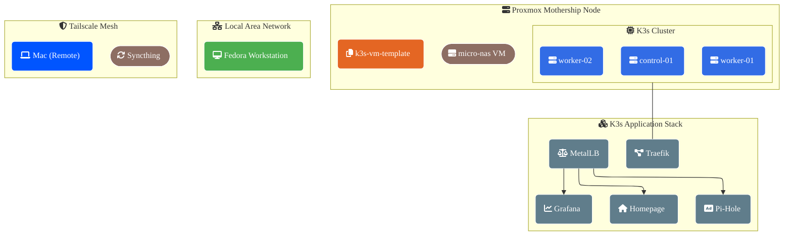

# 🛸 Mothership Homelab: Master Workspace Hub

This centralized repository acts as the single source of truth for the Infrastructure as Code (IaC) blueprints, orchestration configurations, and automation manifests powering the `Mothership` bare-metal homelab environment.

The primary objective is a zero-intervention deployment pipeline that bakes a lightweight base operating system template, provisions high-performance cluster compute nodes on Proxmox VE, and instantly scales a self-healing Kubernetes ecosystem.

---

## 🏗️ Architectural Topology

- Originally I thought mermaid was the way to go but might go with draw.io instead no sure yet...



# 📋 Prerequisites & Local Workstation Setup

Before executing automation targets via the root Makefile, ensure the environment matches these baselines:

## 1. Toolchain Installation (Fedora/RHEL Workstations)

```bash
    sudo dnf install -y packer terraform make openssh-clients kubectl helm
```

## 2. Local SSH Key & Verification Loops

Secure authentication loops rely entirely on public key checks. Ensure the signature exists locally and is bound to the running SSH agent before starting deployments:
Bash

```bash
    eval $(ssh-agent -s)
    ssh-add ~/.ssh/id_ed25519
```

- Security Isolation: NEVER commit local \*.tfvars files. Private keys, network maps, and gateway tokens must remain locally isolated on the workstation to prevent accidental public configuration leaks.

## 3. Hypervisor Storage Allocations

The target Proxmox host system must have the following configuration targets:

    local: Storage target hosting the baseline Ubuntu installation media image (local:iso/ubuntu-24.04.4-live-server-amd64.iso).

    local-lvm: Block pool backend allocation targeted for virtual node root disks (scsi0).

---

---

---

# 📀 Phase 1: Packer Template Generation

Directory Context: terraform/vm_provisioning/packer-k3s/

Automate the installation of an identical, immutable base OS template (ID 777) using Ubuntu's native Subiquity Autoinstall engine hosted on the Proxmox pool.
🕹️ Deep Dive: The Packer boot_command Sequence

The macro simulates keyboard console input during POST initialization to intercept the standard boot loader screen, forcing GRUB into an unattended configuration pipeline:
Terraform

```bash
    boot_command = [
        "<esc><wait3>",
        "c<wait3>",
        "linux /casper/vmlinuz autoinstall <wait>",
        "\"ds=nocloud;s=http://{{ .HTTPIP }}:{{ .HTTPPort }}/\" <wait3>",
        "---<enter><wait3>",
        "initrd /casper/initrd<enter><wait3>",
        "boot<enter>"
    ]
```

1. Bypass Execution: It opens the GRUB terminal panel, sets the automated kernel installation flag (autoinstall), and queries the localized HTTP engine context ({{ .HTTPIP }}:{{ .HTTPPort }}) for custom user/meta-data definitions.
2. Pre-Baked Layers: The baked image pre-stages core binary hooks (INSTALL_K3S_SKIP_START=true), starts up the qemu-guest-agent, seeds workstation access keys, and strips local host machine signatures to guarantee flawless template expansion.
3. Timing & Latency: Embedded <wait3> directives act as defensive buffers, preventing Packer from typing faster than the virtual keyboard buffer can receive characters.

---

# 📦 Phase 2: Compute Provisioning via Terraform

Directory Context: terraform/vm_provisioning/

Consumes the golden template image to provision resource-mapped virtual hardware topologies, inject network configurations, and handle automatic node registration using the baked ID 777 template.
Compute Fleet Profiles

- Manager Plane (k3s-control-01): 2 Cores, 3GB RAM, DHCP Network Allocation.
- Worker Pools (k3s-worker-0[1-N]): 2 Cores, 2GB RAM, Static Networking Matrix (starting at .210 / .211).
- Decentralized Storage Block (micro-nas): Automation target spinning up dedicated sync spaces.

---

# 🌐 Phase 3: Kubernetes Core Infrastructure

Directory Context: kubernetes/infrastructure/

Because bare-metal K3s nodes do not feature a native cloud load balancer controller out of the box, core networking elements handle internal service mapping.

1. MetalLB Load Balancer Layer

MetalLB hooks directly into the physical Layer 2 routing fabric to assign real external IP addresses to cluster services.
Upstream Installation Target:

```bash
kubectl apply -f kubernetes/infrastructure/metallb-config.yaml
```

Configuration Sync: From the project root, apply localized L2 IP pool definitions via the consolidated configurations (kubernetes/infrastructure/metallb-config.yaml).

---

# 🚀 Phase 4: Kubernetes Applications & Services

Directory Context: kubernetes/applications/

## 1. Ad-Blocking Engine: Pi-hole Deployment

Establishes a single service instance that co-locates core DNS filtering networks and web administration interfaces.

Dedicated IP Profile: 192.168.50.242 (DNS: 53/UDP & 53/TCP | Web Panel: 80/TCP)

- Web Admin Panel Path: http://192.168.50.242/admin
- Default Credentials: AdminHomelabPass123
- Persistent Storage Architecture: Currently mapped to local node hostPath space (/var/data/pihole/config). Data strictly belongs to the physical worker host running the active pod. For absolute cross-node mobility, transition this layer to a distributed engine (e.g., Longhorn or NFS).
- Runtime Administrative Passwords: Update access configurations directly via the execution namespace:

```bash
 kubectl exec -it -n networking deployment/pihole-dns-server -- pihole setpassword
```

## 2. Observability Suite: Monitoring Stack

Deploys a comprehensive performance tracking layer via clean Helm upgrade and installation operations.

- Engine Scope: Orchestrates Prometheus, Grafana, Loki, and Alloy pipelines securely.
- Workspace Flush (Danger Target): Wipe all logging workloads in the environment completely:

```bash
    kubectl delete all --all -n monitoring
```

# 📁 Storage Systems Synchronization: Obsidian Vault

Resource Engine Context: terraform/vm_provisioning/micro-nas.tf

The automated storage configuration provisions explicit Tailscale and Syncthing instances for decentralized, private file replication across client networks.

- GUI Administration Panel Entry: Fetch the Tailscale engine network address with tailscale ip -4 on the micro-nas and route via local web browser to http://[TAILSCALE-IP]:8384.
- Permissions Mitigation: Syncthing operates within the gman user space context. If synchronization drops or hits authorization errors, align file tree parameters directly on the host node:

```bash
    sudo chown -R gman:gman /mnt/obsidian-vault
```

---

# 🛑 Operations & Lifecycle Troubleshooting

## 1. Manual K3s Cluster Token Synchronization

Every single time the primary manager plane node (k3s-control-01) is destroyed and re-provisioned, it mints a fresh, randomized cluster authorization hash. You must manually sync this hash to allow worker nodes to register cleanly.

- Step A (Run on Manager Host Node): Extract the token:

  ```bash
      sudo cat /var/lib/rancher/k3s/server/node-token
  ```

- Step B (Update & Sync Local Host Workstation): Paste that token value right into the local workstation `terraform.tfvars` file under the `k3s_share_token` parameter block.

- Step C (Force Refresh Node Subsystems if Agent Sync Desyncs):
  ```bash
      sudo systemctl daemon-reload && sudo systemctl restart k3s-agent
  ```

## 2. Diagnostic Layout Validations

- Verify split-horizon route validation loops directly across the local LAN interface:
  ```bash
      curl -I -H "Host: pihole.freesalty.com" [http://192.168.50.240/admin/](http://192.168.50.240/admin/)
  ```

---

---

---

# ⚙️Docker Subsystem Block

- At the moment I haven't had a need to use `docker`. But you might, or I might in the future.

---

---

---

# 🛠️ Hypervisor & Cluster Native CLI Shortcuts

Drop these native diagnostic profiles straight into the workstation shell configuration file (e.g., `~/.zshrc` or `~/.bashrc`).

## Proxmox Host CLI Commands (qm & pct)

```bash
    # VM Management Controls
    qm list                  # Print a complete matrix of all virtual machines and allocations
    qm start <vmid>          # Power on a specific VM node instance (e.g., qm start 100)
    qm shutdown <vmid>       # Gracefully trigger standard OS guest power-off via Agent

    # Container Operations
    pct list                 # List running LXC containers on host hardware
    pct enter <vmid>         # Drop straight into a root shell inside a running LXC container
```

## Kubernetes CLI Commands

You will inevitably run into issues, and situations requiring you to work directly inside the cluster.
These are some of the more common kubectl I found myself repeating; turned into aliases for simplicity.

```bash
    # Cluster Routing Switchers
    alias kcontext-MOTHERSHIP="kubectl config use-context default"
    alias kcurr-context="kubectl config get-contexts"

    # Global System Diagnostics
    alias kinfo="kubectl cluster-info"
    alias kver="kubectl version --client"
    alias knodes="kubectl get nodes -o wide"

    # Resource Lookups
    alias kall-net="kubectl get all -n networking"
    alias kpods="kubectl get pods -o wide"
    alias ksvc="kubectl get svc --all-namespaces"
    alias kingress="kubectl get ingress --all-namespaces"

    # Real-Time Stream Tailing
    alias klogs="kubectl logs -f --tail=100"
    alias klogs-net="kubectl logs -f --tail=100 -n networking"

    # Interactive Pod Shell Drop-In
    alias kexec="kubectl exec -it"

    alias kcontext-MOTHERSHIP="kubectl config use-context default"
    alias kcurr-context="kubectl config get-contexts"

    # Global System Diagnostics

    alias kinfo="kubectl cluster-info"
    alias kver="kubectl version --client"
    alias knodes="kubectl get nodes -o wide"
    alias khealth="kubectl get componentstatuses"

    # Resource Lookups

    alias kall-net="kubectl get all -n networking"
    alias kpods="kubectl get pods -o wide"
    alias kdeployments="kubectl get deployment"
    alias ksvc="kubectl get svc --all-namespaces"
    alias kingress="kubectl get ingress --all-namespaces"

    # Ingress Controller Rules

    alias kwhitelist="kubectl get configmap -n ingress-nginx-internal ingress-nginx-controller -o jsonpath='{.data.whitelist-source-range}'"

    # Cluster Node Endpoint Extractors

    alias kips="kubectl get nodes -o jsonpath='{.items[*].status.addresses[?(@.type == \"InternalIP\")].address}'"
    alias kips-external="kubectl get nodes -o jsonpath='{.items[*].status.addresses[?(@.type == \"ExternalIP\")].address}'"

    # Real-Time Stream Tailing

    alias klogs="kubectl logs -f --tail=100"
    alias klogs-net="kubectl logs -f --tail=100 -n networking"

    # Interactive Pod Shell Drop-In

    alias kexec="kubectl exec -it"

    # Deployment Rollout Revisions Trace

    alias krev-pihole="kubectl rollout history deployment/pihole-dns-server -n networking"
    alias krev-tunnel="kubectl rollout history deployment/cloudflared-tunnel -n networking"

    # Local Proxy Management

    alias kproxy="kubectl proxy"
    alias kkill="pkill -9 -f 'kubectl proxy'"

    # Modern On-Demand Token Generator (Valid for 1 hour)

    alias ktoken="kubectl -n kubernetes-dashboard create token admin-user"

    # Inspect config-map value for a deployment

    alias homepage-config="kubectl get configmap homepage-config -n networking -o yaml"
```
