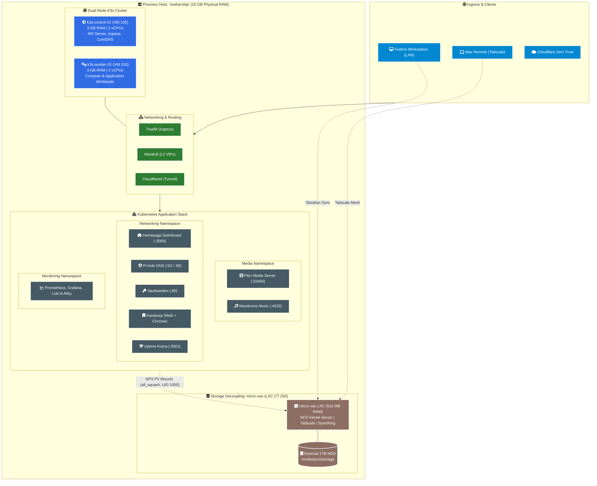

# 🛸 Mothership Homelab
## About
Declaritive first homelab; Opinionated: ProxMox + K3s + Ubuntu Server
- Terraform
- Packer
- Traefik + CloudFlare tunnel

---

Recently got into homeballing. This is my way of working on my DevOps and automation skills. 
This is a *declaritive* first approach. I am lazy and configuration drift is something I wanted to avoid as much as possible.
Everything is IaC, configs + application layer. While I built this project for me. I made it so anyone can hopefully come and grab what they want/need. This is a ProxMox + K3S setup. with Ubuntu server for the VMs & LXCs. Performance is highly important to me, partly because RAM is worth more than gold... literaly. At the time of writing, this entire setup runs on a single laptop with 16GB of RAM + 1TB external. If you like it take it - give it a star tho tha'd be nice :)

---

## 🏗️ Architectural Topology


```mermaid
flowchart TB
    classDef k3s fill:#326ce5,stroke:#fff,stroke-width:2px,color:#fff;
    classDef proxmox fill:#e46623,stroke:#fff,stroke-width:2px,color:#fff;
    classDef storage fill:#8d6e63,stroke:#fff,stroke-width:2px,color:#fff;
    classDef network fill:#2e7d32,stroke:#fff,stroke-width:2px,color:#fff;
    classDef app fill:#455a64,stroke:#fff,stroke-width:1px,color:#fff;
    classDef client fill:#0288d1,stroke:#fff,stroke-width:1px,color:#fff;

    subgraph Clients["fa:fa-globe Ingress & Clients"]
        direction LR
        Fedora["fa:fa-desktop Fedora Workstation (LAN)"]:::client
        MacRemote["fa:fa-laptop Mac Remote (Tailscale)"]:::client
        CloudflareEdge["fa:fa-cloud Cloudflare Zero Trust"]:::client
    end

    subgraph Proxmox_Mothership["fa:fa-server Proxmox Host: 'mothership' (16 GB Physical RAM)"]
        direction TB

        subgraph Storage_Layer["fa:fa-database Storage Decoupling: micro-nas (LXC CT 250)"]
            MicroNAS["fa:fa-hdd micro-nas LXC (512 MB RAM)\nNFS Kernel Server | Tailscale | Syncthing"]:::storage
            ExtHDD[("fa:fa-database External 1TB HDD\n/mnt/export/storage")]:::storage
            MicroNAS --- ExtHDD
        end

        subgraph K3s_Cluster["fa:fa-microchip Dual-Node K3s Cluster"]
            direction LR
            ControlPlane["fa:fa-shield-alt k3s-control-01 (VM 100)\n3 GB RAM | 2 vCPUs\nAPI Server, Ingress, CoreDNS"]:::k3s
            WorkerNode["fa:fa-cogs k3s-worker-01 (VM 210)\n3 GB RAM | 2 vCPUs\nCompute & Application Workloads"]:::k3s
        end

        subgraph Ingress_Networking["fa:fa-network-wired Networking & Routing"]
            direction LR
            Traefik["Traefik (Ingress)"]:::network
            MetalLB["MetalLB (L2 VIPs)"]:::network
            Cloudflared["Cloudflared (Tunnel)"]:::network
        end

        subgraph Applications["fa:fa-cubes Kubernetes Application Stack"]
            direction TB
            subgraph Media_Namespace["Media Namespace"]
                Plex["fa:fa-film Plex Media Server (:32400)"]:::app
                Navidrome["fa:fa-music Navidrome Music (:4533)"]:::app
            end
            subgraph Networking_Namespace["Networking Namespace"]
                Homepage["fa:fa-home Homepage Dashboard (:3000)"]:::app
                PiHole["fa:fa-shield-virus Pi-hole DNS (:53 / :80)"]:::app
                Vaultwarden["fa:fa-key Vaultwarden (:80)"]:::app
                Karakeep["fa:fa-bookmark Karakeep (Meili + Chrome)"]:::app
                UptimeKuma["fa:fa-heartbeat Uptime Kuma (:3001)"]:::app
            end
            subgraph Monitoring_Namespace["Monitoring Namespace"]
                Monitoring["fa:fa-chart-line Prometheus, Grafana, Loki & Alloy"]:::app
            end
        end
    end

    Clients --> Ingress_Networking
    Ingress_Networking --> Applications
    K3s_Cluster --- Ingress_Networking
    Applications -. "NFS PV Mounts (all_squash, UID 1000)" .-> MicroNAS
    Fedora -. "Obsidian Sync" .-> MicroNAS
    MacRemote -. "Tailscale Mesh" .-> MicroNAS
```

# 📋 Prerequisites & Local Workstation Setup

Before executing automation targets via the root Makefile, ensure the environment matches these baselines:

## 1. Toolchain Installation (Fedora/RHEL Workstations)

```bash
    sudo dnf install -y packer terraform make openssh-clients kubectl helm
```

## 2. Local SSH Key & Verification Loops

Secure authentication loops rely entirely on public key checks. Ensure the signature exists locally and is bound to the running SSH agent before starting deployments:

```bash
    eval $(ssh-agent -s)
    ssh-add ~/.ssh/id_ed25519
```

- Security Isolation: NEVER commit local \*.tfvars files. Private keys, network maps, and gateway tokens must remain locally isolated on the workstation to prevent accidental public configuration leaks.

## 3. Hypervisor Storage Allocations

The target Proxmox host system must have the following configuration targets:

    local: Storage target hosting the baseline Ubuntu installation media image (local:iso/ubuntu-26.04.1-live-server-amd64.iso) and LXC template (local:vztmpl/ubuntu-26.04-standard_26.04-1_amd64.tar.zst).

    local-lvm: Block pool backend allocation targeted for virtual node root disks (scsi0).

---

---

---

# 📀 Phase 1: Packer Template Generation

Directory Context: terraform/vm_provisioning/packer-k3s/

Automate the installation of an identical, immutable base OS template (ID 777) using Ubuntu's native Subiquity Autoinstall engine hosted on the Proxmox pool.
🕹️ Deep Dive: The Packer boot_command Sequence

```bash
    boot_command = [
        "<esc><wait3>",
        "c<wait3>",
        "linux /casper/vmlinuz autoinstall <wait>",
        "\"ds=nocloud;s=http://{{ .HTTPIP }}:{{ .HTTPPort }}/\" <wait3>",
        "---<enter><wait3>",
        "initrd /casper/initrd<enter><wait3>",
        "boot<enter>"
    ]
```

The macro simulates keyboard console input during POST initialization to intercept the standard boot loader screen, forcing GRUB into an unattended configuration pipeline via `Packer/Terraform`. This helps inject the custom cloud-init config. via `user-data` file defined in `packer-k3s/http`. [Read more about it here](./terraform/vm_provisioning/packer-k3s/README.md)

---

# 📦 Phase 2: Compute Provisioning via Terraform

Directory Context: `terraform/vm_provisioning/*`

Consumes the golden template image to provision resource-mapped virtual hardware topologies, inject network configurations, and handle automatic node registration using the baked `ID 777` template.
Compute Fleet Profiles

- Manager Plane (k3s-control-01): 2 Cores, 3GB RAM, DHCP Network Allocation.
- Worker Pools (k3s-worker-0[1-N]): 2 Cores, 2GB RAM, Static Networking Matrix (starting at .210 / .211).
- Decentralized Storage Block (micro-nas): Automation target spinning up dedicated sync spaces. Outside of the K3s cluster, this ensures data safety and lets me play around with pods, replicas and svcs without fear of data loss.

---

# 🌐 Phase 3: Kubernetes Core Infrastructure

Directory Context: `kubernetes/infrastructure/*`

Because bare-metal K3s nodes do not feature a native cloud load balancer controller out of the box, core networking elements handle internal service mapping.

1. MetalLB Load Balancer Layer

MetalLB hooks directly into the physical Layer 2 routing fabric to assign real external IP addresses to cluster services.
Upstream Installation Target:

```bash
kubectl apply -f kubernetes/infrastructure/metallb-config.yaml
```

Configuration Sync: From the project root, apply localized L2 IP pool definitions via the consolidated configurations (kubernetes/infrastructure/metallb-config.yaml).

---

# 🚀 Phase 4: Kubernetes Applications & Services

Directory Context: `kubernetes/applications/*`

## 1. Ad-Blocking Engine: Pi-hole Deployment

Establishes a single service instance that co-locates core DNS filtering networks and web administration interfaces.

Dedicated IP Profile: 192.168.50.242 (DNS: 53/UDP & 53/TCP | Web Panel: 80/TCP)

- Web Admin Panel Path: https://pihole.freesatly.com/admin (this will be different for everybody of course)
- Persistent Storage Architecture: Currently mapped to local node hostPath space (/var/data/pihole/config). Data strictly belongs to the physical worker host running the active pod. For absolute cross-node mobility, transition this layer to a distributed engine (e.g., Longhorn or NFS).
- Runtime Administrative Passwords: Update access configurations directly via the execution namespace:

```bash
 kubectl exec -it -n networking deployment/pihole-dns-server -- pihole setpassword
```

## 2. Observability Suite: Monitoring Stack

Deploys a comprehensive performance tracking layer via clean Helm upgrade and installation operations.

- Engine Scope: Orchestrates Prometheus, Grafana, Loki, and Alloy pipelines securely.
- Workspace Flush (Danger Target): Wipe all logging workloads in the environment completely:

```bash
    kubectl delete all --all -n monitoring
```

# 📁 Storage Architecture & Decoupling: "What is Where"

Resource Engine Context: [terraform/vm_provisioning/micro-nas.tf](./terraform/vm_provisioning/micro-nas.tf)

The core principle of this homelab is **Cluster & Storage Decoupling**: Compute is transient, but persistent data is static. Sensitive and stateful data (Obsidian notes, Vaultwarden passwords, Navidrome music, Plex media/metadata) live strictly **outside** the K3s cluster lifecycle on the dedicated `micro-nas` LXC container (`192.168.50.250`, CT 250).

### 1. Physical Hardware & Memory Allocation (16 GB Host Footprint)

```text
PROXMOX HOST: mothership (16 GB Physical RAM Total)
├── 🚀 nvme0n1 (238.5G NVMe SSD) -> VG: `pve` (Pool: `local-lvm`)
│   ├── Host Root (`/`) & Proxmox Hypervisor Overhead
│   ├── VM 100 [k3s-control-01]: 30G NVMe | 3,072 MB (3 GB) RAM (Control Plane & Core Services)
│   ├── VM 210 [k3s-worker-01]:  30G NVMe | 3,072 MB (3 GB) RAM (Workloads & App Stack)
│   ├── CT 250 [micro-nas]:      15G NVMe |   512 MB (0.5 GB) RAM (LXC NFS & Syncthing Engine)
│   └── ⚡ Available Host Headroom: ~9.4 GB RAM for ZFS ARC, Linux page cache, and future workloads
│
└── 💽 sda (931.5G / 1TB External HDD) -> Mounted to `/mnt/export/storage`
    └── CT 250 [micro-nas]: Dedicated Thin Disk Mount Point (Stateful NFS Shares)
```

### 2. Standardized Storage Pattern: `/mnt/export/storage/<application-name>`

Inside `micro-nas` (`192.168.50.250`), persistent storage is mounted under `/mnt/export/storage`. Applications consume isolated NFS shares using hardened `all_squash` rules scoped strictly to the K3s node IPs (`192.168.50.185` and `192.168.50.210`):

| Application | Micro-NAS File Path | NFS Export Rule (`/etc/exports`) | Consumer / Protocol | Description |
| :--- | :--- | :--- | :--- | :--- |
| **Vaultwarden** | `/mnt/export/storage/vaultwarden` | `/mnt/export/storage/vaultwarden 192.168.50.185(...) 192.168.50.210(...)` | K3s NFS PV (`vaultwarden-nas-pv`) | Encrypted password vault database & RSA keys |
| **Navidrome (Data)** | `/mnt/export/storage/navidrome/data` | `/mnt/export/storage/navidrome/data 192.168.50.185(...) 192.168.50.210(...)` | K3s NFS PV (`navidrome-config-pv`) | SQLite database (`navidrome.db`), cache & artwork |
| **Navidrome (Music)** | `/mnt/export/storage/navidrome/music` | `/mnt/export/storage/navidrome/music 192.168.50.185(...) 192.168.50.210(...)` | K3s NFS PV (`navidrome-music-pv`) | Audio tracks, albums, and FLAC/MP3 files |
| **Plex (Config & DB)** | `/mnt/export/storage/plex/config` | `/mnt/export/storage/plex/config 192.168.50.185(...) 192.168.50.210(...)` | K3s NFS PV (`plex-config-pv`, 20Gi) | Server metadata, SQLite DB, agent state |
| **Plex (Media Library)**| `/mnt/export/storage/plex/media` | `/mnt/export/storage/plex/media 192.168.50.185(...) 192.168.50.210(...)` | K3s NFS PV (`plex-media-pv`, 500Gi) | Movies, TV series, video content |
| **Obsidian Vault** | `/mnt/export/storage/obsidian` | N/A (Syncthing user space) | Syncthing / Tailscale Mesh | Markdown notes synchronized across devices |

### 3. File Permissions & Security Hardening
- **Container UID/GID**: NFS exports for K8s container workloads are permissioned with `chown -R 1000:1000` to match standard non-root container workloads.
- **Root Squashing**: All NFS exports enforce `all_squash,anonuid=1000,anongid=1000`, ensuring client-side root processes can never execute with root privileges on the NAS host filesystem.
- **Syncthing Tailscale Isolation**: Syncthing's web admin GUI is bound strictly to the host's private Tailscale IP (`[TAILSCALE-IP]:8384`), keeping port 8384 closed on the physical LAN.

### 4. Manual Maintenance & Storage Permissions (`micro-nas`)

> [!WARNING]
> **Manual Changes Required on Existing Micro-NAS**: Because `micro-nas` (CT 250) is persistent and decoupled (never destroyed during compute teardowns or worker rebuilds), cloud-init `runcmd` directives in `micro-nas.tf` **only run once on initial container provisioning**.
>
> Any subsequent directory creation, ownership changes (`chown`), permission adjustments (`chmod`), or `/etc/exports` rule additions on an existing `micro-nas` instance are **manual changes** and must be run directly on `micro-nas` (`192.168.50.250` or via `pct enter 250` on the Proxmox host).

#### Required Manual Setup / Fix Commands

```bash
# 1. Connect to micro-nas
ssh gman@192.168.50.250
# Or from Proxmox host: pct enter 250

# 2. Create persistent directories
sudo mkdir -p /mnt/export/storage/{vaultwarden,navidrome/data,navidrome/music,plex/config,plex/media,obsidian}

# 3. Apply ownership (1000:1000 for K8s container workloads, gman for Obsidian sync)
sudo chown -R 1000:1000 /mnt/export/storage/vaultwarden
sudo chown -R 1000:1000 /mnt/export/storage/navidrome
sudo chmod -R 775 /mnt/export/storage/navidrome/music
sudo chmod -R 775 /mnt/export/storage/navidrome/data
sudo chown -R 1000:1000 /mnt/export/storage/plex
sudo chmod -R 775 /mnt/export/storage/plex/media
sudo chown -R gman:gman /mnt/export/storage/obsidian

# 4. Configure /etc/exports for the dual-node cluster IPs (192.168.50.185 & 192.168.50.210)
sudo tee /etc/exports > /dev/null << 'EOF'
/mnt/export/storage/vaultwarden 192.168.50.185(rw,sync,no_subtree_check,all_squash,anonuid=1000,anongid=1000) 192.168.50.210(rw,sync,no_subtree_check,all_squash,anonuid=1000,anongid=1000)
/mnt/export/storage/navidrome/data 192.168.50.185(rw,sync,no_subtree_check,all_squash,anonuid=1000,anongid=1000) 192.168.50.210(rw,sync,no_subtree_check,all_squash,anonuid=1000,anongid=1000)
/mnt/export/storage/navidrome/music 192.168.50.185(rw,sync,no_subtree_check,all_squash,anonuid=1000,anongid=1000) 192.168.50.210(rw,sync,no_subtree_check,all_squash,anonuid=1000,anongid=1000)
/mnt/export/storage/plex/config 192.168.50.185(rw,sync,no_subtree_check,all_squash,anonuid=1000,anongid=1000) 192.168.50.210(rw,sync,no_subtree_check,all_squash,anonuid=1000,anongid=1000)
/mnt/export/storage/plex/media 192.168.50.185(rw,sync,no_subtree_check,all_squash,anonuid=1000,anongid=1000) 192.168.50.210(rw,sync,no_subtree_check,all_squash,anonuid=1000,anongid=1000)
EOF

# 5. Apply and reload export rules
sudo exportfs -rav
```

> [!IMPORTANT]
> **Zero Data Loss Guarantee**: You can safely run `make destroy-workers` or `make destroy-all` to completely tear down and re-provision the K3s cluster. As long as `micro-nas` (CT 250) remains intact, zero persistent application or note data will ever be lost.

---

# 🛑 Operations & Lifecycle Troubleshooting

## 1. Safe Dual-Node Migration & Node Draining

When scaling down from 2 workers to 1 worker (transitioning to the dual-node topology), gracefully evict running pods before applying Terraform changes:

```bash
# 1. Gracefully cordon and drain k3s-worker-02 (evicts pods to worker-01 and control-01)
make drain-worker-02

# 2. Apply Terraform to decommission VM 211 and reconfigure cluster resources
make t-apply-infra

# 3. Clean up the node registration from Kubernetes
kubectl delete node k3s-worker-02
```

Every single time the primary manager plane node (k3s-control-01) is destroyed and re-provisioned, it mints a fresh, randomized cluster authorization hash. You must manually sync this hash to allow worker nodes to register cleanly.

- Step A (Run on Manager Host Node): Extract the token:

  ```bash
      sudo cat /var/lib/rancher/k3s/server/node-token
  ```

- Step B (Update & Sync Local Host Workstation): Paste that token value right into the local workstation `terraform.tfvars` file under the `k3s_share_token` parameter block.

- Step C (Force Refresh Node Subsystems if Agent Sync Desyncs):
  ```bash
      sudo systemctl daemon-reload && sudo systemctl restart k3s-agent
  ```

## 2. Diagnostic Layout Validations

- Verify split-horizon route validation loops directly across the local LAN interface:
  ```bash
      curl -I -H "Host: pihole.example.com" [http://192.168.50.240/admin/](http://192.168.50.240/admin/)
  ```

---

---

---

# ⚙️Docker Subsystem Block

- At the moment I haven't had a need to use `docker`. But you might, or I might in the future.

---

---

---

# 🛠️ Hypervisor & Cluster Native CLI Shortcuts

## Proxmox Host CLI Commands (qm & pct)

```bash
    # VM Management Controls
    qm list                  # Print a complete matrix of all virtual machines and allocations
    qm start <vmid>          # Power on a specific VM node instance (e.g., qm start 100)
    qm shutdown <vmid>       # Gracefully trigger standard OS guest power-off via Agent

    # Container Operations
    pct list                 # List running LXC containers on host hardware
    pct enter <vmid>         # Drop straight into a root shell inside a running LXC container
```

## Proxmox Host Maintenance & Package Upgrades

To keep Proxmox VE secure and updated, execute updates from the Proxmox host CLI over SSH (`root@<proxmox-ip>`).

> [!IMPORTANT]
> **Always use `apt-get dist-upgrade` (or `apt full-upgrade`)** on Proxmox VE. Never run `apt upgrade`, as standard upgrades will not install new dependency packages or resolve kernel package transitions, which can break Proxmox meta-packages (`proxmox-ve`, `pve-manager`, `qemu-server`).

### 1. Check for Available Updates
```bash
apt-get update
apt list --upgradable
```

### 2. Execute Distribution Upgrade
```bash
# Safe non-interactive upgrade preserving local configuration
DEBIAN_FRONTEND=noninteractive apt-get update && \
DEBIAN_FRONTEND=noninteractive apt-get dist-upgrade -y -o Dpkg::Options::="--force-confdef" -o Dpkg::Options::="--force-confold"
```

### 3. Verify Installed Versions
```bash
pveversion -v
```

### 4. Kernel Reboot Procedure (When Needed)
When a new kernel (`proxmox-kernel-*`) is installed, a host reboot is required to activate it:
```bash
# 1. Gracefully shut down active workloads
qm shutdown 100    # k3s-control-01
qm shutdown 210    # k3s-worker-01
pct stop 250       # micro-nas

# 2. Reboot Proxmox host
systemctl reboot

# 3. Verify running kernel post-reboot
uname -r
```

## Kubernetes CLI Commands

Drop these native diagnostic profiles straight into the workstation shell configuration file (e.g., `~/.zshrc` or `~/.bashrc`).

You will inevitably run into issues, and situations requiring you to work directly inside the cluster.
These are some of the more common kubectl I found myself repeating; turned into aliases for simplicity.

```bash
    # Cluster Routing Switchers
    alias kcontext-default="kubectl config use-context default"
    alias kcurr-context="kubectl config get-contexts"

    # Global System Diagnostics
    alias kinfo="kubectl cluster-info"
    alias kver="kubectl version --client"
    alias knodes="kubectl get nodes -o wide"
    alias khealth="kubectl get componentstatuses"

    # Resource Lookups
    alias kall-net="kubectl get all -n networking"
    alias kpods="kubectl get pods -o wide"
    alias kdeployments="kubectl get deployment"
    alias ksvc="kubectl get svc --all-namespaces"
    alias kingress="kubectl get ingress --all-namespaces"

    # Ingress Controller Rules
    alias kwhitelist="kubectl get configmap -n ingress-nginx-internal ingress-nginx-controller -o jsonpath='{.data.whitelist-source-range}'"

    # Cluster Node Endpoint Extractors
    alias kips="kubectl get nodes -o jsonpath='{.items[*].status.addresses[?(@.type == \"InternalIP\")].address}'"
    alias kips-external="kubectl get nodes -o jsonpath='{.items[*].status.addresses[?(@.type == \"ExternalIP\")].address}'"

    # Real-Time Stream Tailing
    alias klogs="kubectl logs -f --tail=100"
    alias klogs-net="kubectl logs -f --tail=100 -n networking"

    # Interactive Pod Shell Drop-In
    alias kexec="kubectl exec -it"

    # Deployment Rollout Revisions Trace
    alias krev-pihole="kubectl rollout history deployment/pihole-dns-server -n networking"
    alias krev-tunnel="kubectl rollout history deployment/cloudflared-tunnel -n networking"

    # Local Proxy Management
    alias kproxy="kubectl proxy"
    alias kkill="pkill -9 -f 'kubectl proxy'"

    # Modern On-Demand Token Generator (Valid for 1 hour)
    alias ktoken="kubectl -n kubernetes-dashboard create token admin-user"

    # Inspect config-map value for a deployment
    alias homepage-config="kubectl get configmap homepage-config -n networking -o yaml"

    # Search ENVIRONMENT variables for a given service
    # kubectl exec -it deployment/karakeep-server -n networking -- env | grep DISABLE
```

# Application Specific

## Karakeep

- Quickly generate a robust string for this value on your terminal using `openssl rand -base64 36`

By default `sign-ups are disabled. To add an additional user:

1. Log into your account at https://karakeep.example.com.
2. Navigate to the Admin Settings page (located in your profile/settings menu).
3. Find the Users List tab and click the Create User button.
4. Input their details (Name, Email, and a temporary password) and hit Create.

### Karakeep Troubleshooting

debugging the browser plugin, if you ran `karakeep-browser.yaml`, but the browser engine claims is `not configured` on the admin panel.

- Start with a network test:

  ```bash
    kubectl exec -it deployment/karakeep-server -n networking -- wget -qO- http://karakeep-browser-service:3000/json
  ```

- Make sure you `karakeep` main deployment manifest, `karakeep-deployment.yaml` in this instance has the websocket env set to:

```
    # Link to Browserless chrome for web scraping
    - name: BROWSER_WEBSOCKET_URL
        value: "ws://karakeep-browser-service:3000"
```

#### Watch live Browser session:

In your karakeep dashboard, drop a JS heavy website like reddit.com.

At the same time run the following command to see the webscrapping engine go brrrr.

```bash
    kubectl port-forward svc/karakeep-browser-service 3000:3000 -n networking
```

2. Stream the Live Container Logs

Open up a couple of split terminal panes (using tmux or your terminal tabs) and tail the log streams for all three components simultaneously while you add the link.

Pane 1: Watch Karakeep coordinate the job

```bash
    kubectl logs deployment/karakeep-server -n networking -f --tail=20
```

    Look for: Logs indicating a new link parsing job has been added to the queue and an upstream connection request sent to the browser wrapper.

Pane 2: Watch Browserless execute the render

```bash
    kubectl logs deployment/karakeep-browser -n networking -f --tail=20
```

    Look for: Session started, logs about Chrome binaries launching, navigation events to reddit.com, and session closure metrics.

Pane 3: Watch Meilisearch build the full-text index

```bash
    kubectl logs deployment/karakeep-meili -n networking -f --tail=20
```

---

## Homepage

Resource Context: [kubernetes/applications/homepage/homepage-deployment.yaml](./kubernetes/applications/homepage/homepage-deployment.yaml) & [kubernetes/applications/homepage/config/](./kubernetes/applications/homepage/config/)

- Web Ingress URL: `https://homepage.example.com`
- Port Profile: `3000/TCP` (ClusterIP Service: `80/TCP`)
- Key Integrations: Central dashboard with live widgets for Proxmox VE, Pi-hole, Tailscale mesh status, Cloudflare Tunnel health, and Grafana / Kubernetes cluster metrics. Uses ServiceAccount token (`homepage-service-account`) with scoped RBAC for native cluster discovery.

### Homepage Troubleshooting

- Inspect rendered ConfigMap files:
  ```bash
  kubectl get configmap homepage-config -n networking -o yaml
  ```
- Verify environment variables and secret injections:
  ```bash
  kubectl exec -it deployment/homepage -n networking -- env | grep HOMEPAGE_VAR_
  ```
- Stream live application runtime logs:
  ```bash
  kubectl logs deployment/homepage -n networking -f --tail=50
  ```
- Fix `403 Forbidden` / Invalid Host Header:
  Ensure `HOMEPAGE_ALLOWED_HOSTS` includes `homepage.example.com,localhost,127.0.0.1` (or your `${DOMAIN_NAME}`) in the deployment environment.

---

## Grafana & Observability Suite

Resource Context: [kubernetes/applications/monitoring/prometheus-values.yaml](./kubernetes/applications/monitoring/prometheus-values.yaml), [loki-values.yaml](./kubernetes/applications/monitoring/loki-values.yaml), and [alloy-values.yaml](./kubernetes/applications/monitoring/alloy-values.yaml)

- Web Ingress URL: `https://grafana.example.com/`
- Port Profile: `80/TCP` (Traefik Ingress routing to Grafana service)
- Persistent Storage: `5Gi` PVC (`promstack-grafana`) for dashboards, alerts, and settings.
- Integrated Data Sources: Prometheus (`kube-prometheus-stack`), Loki log aggregation gateway (`http://my-loki-gateway.monitoring.svc.cluster.local`), and Alloy telemetry collectors running as node DaemonSets.

### Grafana Troubleshooting

- Retrieve the auto-generated Grafana admin password:
  ```bash
  kubectl get secret -n monitoring promstack-grafana -o jsonpath="{.data.admin-password}" | base64 --decode; echo
  ```
- Verify cluster monitoring pods and daemonsets:
  ```bash
  kubectl get pods -n monitoring -o wide
  ```
- Stream Alloy log collection & pipeline ingestion:
  ```bash
  kubectl logs -n monitoring daemonset/alloy -f --tail=50
  ```
- Port-forward Prometheus server UI for direct query/rule inspection:
  ```bash
  kubectl port-forward -n monitoring svc/promstack-kube-prometheus-prometheus 9090:9090
  ```

---

## Pi-hole DNS & Ad-Blocker

Resource Context: [kubernetes/applications/pihole/pihole-deployment.yaml](./kubernetes/applications/pihole/pihole-deployment.yaml)

- Web Ingress URL: `https://pihole.example.com/admin/`
- Dedicated MetalLB VIP: `192.168.50.242`
- Port Profile: `53/UDP & 53/TCP` (DNS Resolution), `80/TCP` (Admin Web GUI)
- Persistent Storage: HostPath volume mounted at `/var/data/pihole/config` (mapped to `/etc/pihole` inside the pod)
- DNS Architecture: Upstream resolvers (`1.1.1.1`, `8.8.8.8`) with custom dnsmasq rule directing local homelab queries (`address=/example.com/192.168.50.240`).

### Pi-hole Troubleshooting

- Reset / update Web GUI admin password:
  ```bash
  kubectl exec -it -n networking deployment/pihole-dns-server -- pihole setpassword
  ```
- Test local and upstream DNS queries:
  ```bash
  dig @192.168.50.242 example.com +short
  dig @192.168.50.242 google.com +short
  ```
- Stream FTL live query resolution logs:
  ```bash
  kubectl exec -it -n networking deployment/pihole-dns-server -- tail -f /var/log/pihole/pihole.log
  ```
- Inspect FTL daemon service status:
  ```bash
  kubectl exec -it -n networking deployment/pihole-dns-server -- pihole status
  ```

---

## Uptime Kuma Status Monitor

Resource Context: [kubernetes/applications/uptime-kuma/uptime-kuma-deployment.yaml](./kubernetes/applications/uptime-kuma/uptime-kuma-deployment.yaml)

- Web Ingress URL: `https://uptime.example.com`
- Port Profile: `3001/TCP` (ClusterIP Service: `80/TCP`)
- Persistent Storage: `uptime-kuma-pvc` (4Gi RWO PV mapped to `/app/data`)
- Deployment Strategy: `Recreate` strategy prevents SQLite database concurrent locks during rollout transitions.

### Uptime Kuma Troubleshooting

- Stream monitor probe logs and heartbeat events:
  ```bash
  kubectl logs deployment/uptime-kuma -n networking -f --tail=50
  ```
- Reset admin credentials via internal CLI:
  ```bash
  kubectl exec -it deployment/uptime-kuma -n networking -- npm run reset-password
  ```
- Inspect SQLite database file integrity and size:
  ```bash
  kubectl exec -it deployment/uptime-kuma -n networking -- ls -lh /app/data/
  ```

---

## Vaultwarden (Bitwarden)

Resource Context: [kubernetes/applications/vaultwarden/vaultwarden-deployment.yaml](./kubernetes/applications/vaultwarden/vaultwarden-deployment.yaml)

- Web Ingress URL: `https://vault.example.com`
- Dedicated MetalLB VIP: `192.168.50.243`
- Port Profile: `80/TCP` (HTTP & integrated WebSocket notifications)
- Persistent Storage: `vaultwarden-nas-pv` (4Gi NFS mount at `/mnt/export/storage/vaultwarden` mapped to `/data` in container, non-root UID `1000:1000`)
- Security Baseline: `SIGNUPS_ALLOWED: "false"`, `WEBSOCKET_ENABLED: "true"`, `ADMIN_TOKEN` protected via Kubernetes Secret.

### Vaultwarden Troubleshooting

- Retrieve Admin Token for `/admin` portal login:
  ```bash
  kubectl get secret vaultwarden-secret -n networking -o jsonpath="{.data.ADMIN_TOKEN}" | base64 --decode; echo
  ```
- Check NFS file ownership and permissions:
  ```bash
  kubectl exec -it deployment/vaultwarden-server -n networking -- ls -la /data
  ```
- Temporarily allow sign-ups for adding new accounts:
  ```bash
  kubectl set env deployment/vaultwarden-server -n networking SIGNUPS_ALLOWED=true
  # Complete registration at https://vault.example.com, then disable again:
  kubectl set env deployment/vaultwarden-server -n networking SIGNUPS_ALLOWED=false
  ```

---

## Plex Media Server

Resource Context: [kubernetes/applications/plex/plex-deployment.yaml](./kubernetes/applications/plex/plex-deployment.yaml)

- Web Ingress URL: `https://plex.example.com/`
- Port Profile: `32400/TCP`
- Persistent Storage:
  - Media Library: `/mnt/export/storage/plex/media` (500Gi NFS PV, read-only mount)
  - Config & DB: `/mnt/export/storage/plex/config` (20Gi NFS PV)
  - Transcoding Scratch Space: Dedicated ephemeral `emptyDir` mounted at `/transcode` (preserves NAS I/O)

### Plex Troubleshooting

- Stream Plex server logs:
  ```bash
  kubectl logs deployment/plex-media-server -n media -f --tail=50
  ```
- Check transcode directory disk usage:
  ```bash
  kubectl exec -it deployment/plex-media-server -n media -- df -h /transcode
  ```
- Verify NFS media mount accessibility:
  ```bash
  kubectl exec -it deployment/plex-media-server -n media -- ls -la /media
  ```

---

## Navidrome Music Server

Resource Context: [kubernetes/applications/navidrome/navidrome-deployment.yaml](./kubernetes/applications/navidrome/navidrome-deployment.yaml)

- Web Ingress URL: `https://music.example.com/`
- Port Profile: `4533/TCP`
- Persistent Storage:
  - Music Library: `/mnt/export/storage/navidrome/music` (200Gi NFS PV, read-only mount)
  - Application Data: `/mnt/export/storage/navidrome/data` (5Gi NFS PV)

### Navidrome Troubleshooting

- Stream music indexing and scanner logs:
  ```bash
  kubectl logs deployment/navidrome -n media -f --tail=50
  ```
- Verify music library files and permissions:
  ```bash
  kubectl exec -it deployment/navidrome -n media -- ls -la /music
  ```
