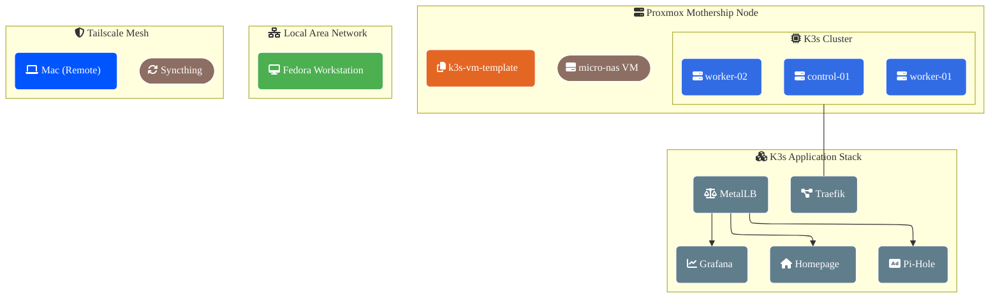

# Homelab K3s Cluster Infrastructure

Automated Proxmox IaC repository to provision a lightweight K3s Kubernetes cluster (1 Manager, N Workers) cloned from a golden Packer made template (**ID 777**).

---

## 🏗️ Architecture Layout

- **Manager Node (`k3s-control-01`):** 2 Cores, 3GB RAM, DHCP IP allocation.
- **Worker Nodes (`k3s-worker-0[1-N]`):** 2 Cores, 2GB RAM, Static IPs, starting at .210 (`192.168.50.210` & `.211`, `.xxx`).
- **Base OS Template:** Ubuntu 24.04 LTS (Pre-baked via Packer).

---

## 🛠️ Automation Matrix (Makefile)

Run commands from the root directory to manage the cluster lifecycle:

```bash
# Initialize and validate configuration
make init
make validate

# Standard Infrastructure Lifecycle
make plan
make apply              # Deploys entire cluster with auto-approval
make destroy-workers    # Targets and tears down only the worker pool
make destroy-manager    # Targets and tears down only the control plane

# The Nuke Options
make destroy-all        # Completely tears down all VMs (includes interactive safety check)
make redeploy-workers   # Pipeline: Nukes everything -> Validates formatting -> Re-applies fresh
```

---

## 🔒 Post-Deployment & Injection Mechanics

### 1. Security Isolation

Ensure you copy `terraform.tfvars.example` to `terraform.tfvars` locally and populate the real tokens and endpoints. The `.tfvars` format is ignored by Git to prevent leak risks on GitHub.

### 2. Cloud-Init Worker Hook

Workers leverage a dynamic Cloud-Init configuration block (`proxmox_virtual_environment_file.k3s_worker_cloud_config`) to auto-register with the control plane upon boot. They pull the cluster join hash directly using `${var.k3s_share_token}` and connect to the manager API at port `6443`.

Here is a streamlined, copy-paste friendly `README.md` section covering cluster token rotation, worker node initialization, and the standard pod validation workflow.

---

---

---

## 🚀 K3s Cluster Configuration & Validation Manual

### 1. Token Rotation & Manual Worker Registration

Every time the `k3s-control-01` manager VM is destroyed and recreated, it mints a **brand-new cluster token**. You must extract this token and provide it to the worker nodes.

#### Extract the New Token (Run on Manager)

```bash
sudo cat /var/lib/rancher/k3s/server/node-token
```

#### Manual Join Execution (Run on Worker Nodes)

SSH into the worker node and run the registration command wrapper. Ensure you substitute the correct token value and target node hostname matching the topography:

```bash
# 1. Check service status on manager node
sudo systemctl status k3s

# 2. If disabled, enable it
sudo systemctl enable k3s.service

# 3. Get K3s token
# (This is the token value you will copy back to the Fedora workstation's terraform.tfvars file so the actual worker VMs can connect).
sudo cat /var/lib/rancher/k3s/server/node-token
```

```bash
# Head over to the worker nodes; paste the following with the above token, and the IP of the manager VM.
curl -sfL https://get.k3s.io | \
  K3S_URL="https://192.168.50.185:6443" \
  K3S_TOKEN="YOUR_FRESHLY_EXTRACTED_SERVER_TOKEN" \
  INSTALL_K3S_SKIP_DOWNLOAD=true \
  INSTALL_K3S_EXEC="agent --node-name=k3s-worker-01" sh -

```

```bash
# Check the status of the k3s instance from the control node. (whiled ssh'd into that control-01)
# Check service health
sudo systemctl status k3s

# Check if port 6443 is actively bound
sudo ss -tlnp | grep 6443
```

### Troubleshooting

If everything is working from the control node, you should see.

```bash
gman@k3s-control-01:~$ sudo k3s kubectl get nodes
NAME             STATUS   ROLES           AGE   VERSION
k3s-control-01   Ready    control-plane   24m   v1.35.5+k3s1
k3s-worker-01    Ready    <none>          16m   v1.35.5+k3s1
k3s-worker-02    Ready    <none>          15s   v1.35.5+k3s1
```

Now from the workstation, if you copied over the .config files, updated the IP.
You should see something like this. The manager/control plane and the workers.

```bash
➜  ~ kubectl get nodes -o wide
NAME             STATUS   ROLES           AGE    VERSION        INTERNAL-IP      EXTERNAL-IP   OS-IMAGE             KERNEL-VERSION      CONTAINER-RUNTIME
k3s-control-01   Ready    control-plane   27m    v1.35.5+k3s1   192.168.50.185   <none>        Ubuntu 24.04.4 LTS   6.8.0-117-generic   containerd://2.2.3-k3s1
k3s-worker-01    Ready    <none>          19m    v1.35.5+k3s1   192.168.50.210   <none>        Ubuntu 24.04.4 LTS   6.8.0-117-generic   containerd://2.2.3-k3s1
k3s-worker-02    Ready    <none>          3m4s   v1.35.5+k3s1   192.168.50.211   <none>        Ubuntu 24.04.4 LTS   6.8.0-117-generic   containerd://2.2.3-k3s1
```

> [!important]
> The Internal IP oc the CONTROL node; has to be the IP found in the .config file, exported from that same node;
> otherwise the local workstation will not find it.

#### Force Service Sync & Restart

If the installation script skips execution because no core binary changes were detected, force `systemd` to parse the new environment variables manually:

```bash
sudo systemctl daemon-reload
sudo systemctl restart k3s-agent

```

---

### 2. Post-Deployment Verification & Debugging Loop

Once the cluster matrix reports a `Ready` state, execute this interactive loop from the local workstation terminal to verify network connectivity and pod scheduling runtime operations.

#### A. Monitor Lifecycle Status

Watch the engine scale the deployment layers and download container image steps in real time:

```bash
kubectl get pods -w
```

_Press `Ctrl + C` to exit the live stream view once the status flags hit `Running` and the readiness gate registers `1/1`._

#### B. Inspect Cluster Network Allocation

Retrieve extended metadata to check pod-to-node routing assignments and target overlay networks:

```bash
kubectl get pods -o wide

```

#### Additional commands.

> 💡 **Networking Note:** Pod IP allocations (e.g., `10.42.0.X`) exist strictly within the cluster's internal overlay network fabric. the local workstation cannot route traffic directly to these endpoints without an active proxy or Ingress gateway controller.

#### C. Establish a Secure Tunnel (Port-Forwarding)

Map a local network port on the workstation directly to an active container endpoint inside the target pod layer:

```bash
# Syntax: kubectl port-forward deployment/<NAME> <LOCAL_PORT>:<CONTAINER_PORT>
kubectl port-forward deployment/internal-test 8080:80

```

_This process locks the terminal pane to keep the proxy network bridge alive. Leave it running._

#### D. Interact with the Cluster API (New Terminal Window)

Open a new terminal tab or pane (`Ctrl + Shift + T`) on the workstation and interact with the application over the localhost bridge:

```bash
curl http://localhost:8080

```

_Alternatively, verify visual elements by routing the web browser to `http://localhost:8080`._

#### E. Clean Up Resources

Once the smoke tests or manual debugging sessions are complete, terminate the test resources to free up internal compute overhead on the Proxmox pool:

1. Go back to the first terminal window and press `Ctrl + C` to tear down the port-forwarding proxy.
2. Delete the test deployment components:

```bash
kubectl delete deployment internal-test
```

## 📁 Synchronization: Obsidian Vault via Syncthing

micro-nas.tf template automatically provisions: `TailScale` & `Syncthing` services, allowing for a decentralized, private sync of an Obsidian(Or any other file based application) vault across machines.

### Accessing the Sync Dashboard

The Syncthing GUI is accessible through the Tailscale network.

1. **Find the NAS IP:** Run `tailscale ip -4` on the `micro-nas` or check the Tailscale admin(preferred) console.
2. **Open the GUI:** Navigate to `http://[the-TAILSCALE-IP]:8384` in the browser.

### Configuring the Sync

1. **Add Remote Device:** On the local machine (e.g., Mac), install Syncthing. Copy the Device ID from `Actions > Show ID` on the NAS and add it to the other clients (Laptops, other PCs, Friends PC), and vice-versa.
2. **Create the Folder:**
   - On the NAS, add a custom folder, set permissions. Or Use the default Sync/ Folder place items in there.
   - On the local machine, pick the local Folder.
3. **Important Note:** Ensure "Encryption" is **unchecked** if you want to be able to edit files natively on the client machines.
4. **Permissions:** The service is configured to run as the `gman` user. If you encounter "Permission Denied" errors, run `sudo chown -R gman:gman /mnt/obsidian-vault` on the NAS to align ownership.

_Tip: Because this is configured as a `systemd --user` service, it will persist through reboots automatically without further configuration._

## High Level Architectural Diagram


